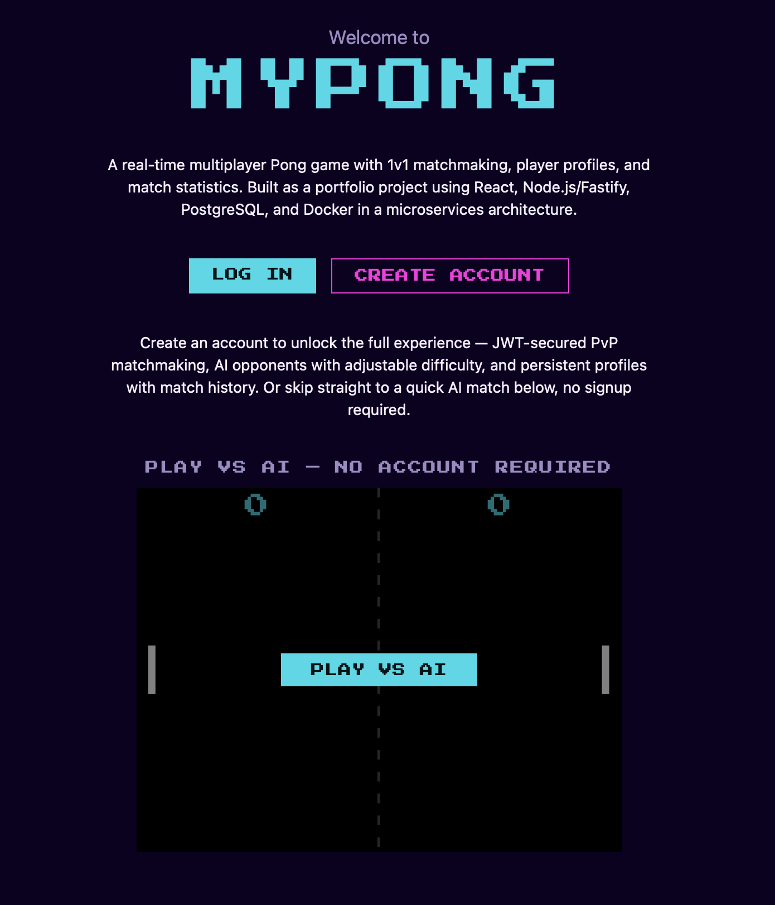

# MyPong
[](https://github.com/SandraKanna/MyPong/actions/workflows/ci.yml)

A real-time multiplayer Pong game: 1v1 online, matchmaking, and an AI opponent. Built as a full-stack portfolio project using a microservices architecture.



MyPong reimplements the scope of Transcendence, a 42 School capstone project, from scratch — same core requirements (real-time gameplay, JWT auth, microservices), rebuilt with modern tooling and stronger engineering practices (TypeScript throughout, React, test automation and CI, consistent test coverage) than the original assignment required.

---

## What is implemented today

- **auth-service** — register, login, refresh (with rotation), logout (with revocation)
- **user-service** — profile (display name), avatar upload, match stats and history
- **gateway-api** — REST proxy with JWT validation for protected routes
- **gateway-ws** — WebSocket hub: browser auth, message routing by type prefix, user-targeted delivery
- **game-service** — real-time physics (ball, paddles, score), session lifecycle, pause/reconnect grace window
- **match-service** — FIFO matchmaking queue, match creation and closure, history event emission
- **ai-bot-service** — AI opponent for PvE matches, guest and logged-in play, difficulty presets
- **Public Edge (nginx)** — TLS termination, reverse proxy, static frontend serving, avatar serving
- **frontend** — login/register, protected routing, profile + avatar, 1v1 game (lobby, countdown, live board, pause overlay, result screen)

See [Running a service locally](#running-a-service-locally) below for endpoint-level detail on each piece.

AI opponent and guest mode are fully implemented. Tournament mode — part of Transcendence's original requirements — was evaluated and intentionally left out of this rebuild's scope; see the note under [Phase plan](#phase-plan).

---

## Prerequisites

- Docker and Docker Compose
- Make
- Node.js 24 (only needed for the native dev setup in each service's README)

## Quick start

1. **Clone the repo**
```bash
git clone git@github.com:SandraKanna/MyPong.git && cd MyPong
```
2. **Create your `.env`** and fill in the secrets:
```bash
cp .env.example .env
```
Set `JWT_SECRET`, `JWT_REFRESH_SECRET`, `INTERNAL_SERVICE_SECRET` and `POSTGRES_PASSWORD`, then point `DATABASE_URL` at that same password. Every variable is documented inline in `.env.example`.

3. **Generate the local TLS cert** (one-time, self-signed):
```bash
./scripts/generate-dev-cert.sh
```
4. **Start the stack:**
```bash
make up
```
Builds the images, starts every service, and runs all migrations in dependency order (`auth-service`, then `user-service`, then `match-service`, since `user-service`'s tables have a foreign key into `auth-service`'s `users` table).

5. **Open `https://localhost`** and accept the certificate warning once.

To play from another device on the same network, see [Playing over a local network](#playing-over-a-local-network).

> **macOS + Safari:** Safari validates certs against the system Keychain and won't accept an untrusted cert on a WebSocket, so `https://localhost` renders but the game stays stuck on "Connecting...". Trust the dev cert at the system level (one-time), then fully quit Safari (Cmd+Q) and reopen — a hard-refresh alone isn't enough, Safari only re-checks trust when the process restarts:
>
> ```bash
> sudo security add-trusted-cert -d -r trustRoot -k /Library/Keychains/System.keychain nginx/certs/cert.pem
> ```
>
> Re-run that (and quit/reopen again) after any `--force` regeneration. Firefox and Chrome use their own trust stores and aren't affected. More in [nginx's README](nginx/README.md#tls-certificates-local-dev).

---

## Playing over a local network

Any device on the same network can play MyPong by pointing a browser at the host machine's LAN address, with no install and no per-device setup, on any OS. The stack is self-hosted and runs on a single machine; there is no public deployment.

It works with zero configuration because the frontend reaches the backend only through relative paths (`/api/*`, `/ws`), so the app is same-origin whatever host serves it. nginx is the single entry point and its `443` port is reachable across the LAN, so hitting the host by IP resolves the full stack (REST, WebSocket, matchmaking) exactly as `localhost` does.

To try it:

1. Get the host's LAN IP (`ipconfig getifaddr en0` on macOS, `hostname -I` on Linux).
2. From another device on the same WiFi, open `https://<that-ip>`.
3. Accept the certificate warning once. The dev cert is issued for `localhost`, so browsers flag a name mismatch when you connect by IP; see [nginx's README](nginx/README.md#tls-certificates-local-dev) for trusting it properly.

Two accounts on two machines can queue into the same FIFO match and play a real 1v1. If the other device can't reach the host, the cause is usually the host firewall blocking `443` or client isolation on the network (common on guest WiFi), not the stack.

---

## Running a service locally

Each service has its own README with the full setup (Docker + native) and smoke test:

- [`services/auth-service/README.md`](services/auth-service/README.md)
- [`services/gateway-api/README.md`](services/gateway-api/README.md)
- [`services/gateway-ws/README.md`](services/gateway-ws/README.md)
- [`services/user-service/README.md`](services/user-service/README.md)
- [`services/game-service/README.md`](services/game-service/README.md)
- [`services/match-service/README.md`](services/match-service/README.md)
- [`services/ai-bot-service/README.md`](services/ai-bot-service/README.md)
- [`nginx/README.md`](nginx/README.md)
- [`frontend/README.md`](frontend/README.md)

---

## CI

Backend services run through 4 jobs in sequence: **lint → typecheck → test → docker-build**, using a matrix over all implemented services. Services within a stage run in parallel.
Adding a new backend service in a future phase = one string added to the matrix.

The frontend (including Public Edge/nginx) runs as a separate job: **lint → typecheck → test → build**, with nginx's Docker build as its final step.

`main` is protected by a GitHub Ruleset: PRs are required, and all required checks (backend matrix + Frontend job) must be green before merge.

---

## Phase plan

|  Phase  |                 Description
|---------|-----------------------------------------------------------------------------------
|   0     | Repo structure, tsconfig, Docker Compose skeleton, Makefile, CI (Done)
|   1     | auth-service + gateway-api + frontend login/register + Public Edge (Done)
|   2     | user-service + frontend profile + avatar upload (Done)
|   3     | gateway-ws hub + game-service (physics, session lifecycle, pause/reconnect) + match-service (matchmaking, match lifecycle, stats/history recording) (Done)
|   4     | Full game frontend: lobby, 3s countdown, live board, pause overlay, result screen (Done)
|   5     | ai-bot-service + guest mode (Done)
|   6     | Onboarding polish, batch profile lookup, profile stats frontend, in-match username display, single-session-per-user enforcement (Done).
|   7     | Unit test coverage review across all services (Done)
|   8     | Full CI coverage across all services + final README (Done)

> tournament-service was designed (DB schema + WebSocket contracts) but intentionally left out of this portfolio's scope — the architectural pattern it would demonstrate (a WebSocket-client service with its own database, connected to the gateway) is already fully demonstrated by match-service.

---

## Stack

| Layer     |                      Technology                          
|-----------|-------------------------------------------------------------
| Frontend  | React 19 + TypeScript 6 + Vite 8 + Zustand + React Router
| Backend   | Node.js 24 + Fastify + TypeScript (strict, compiled) 
| Auth      | JWT (access 15 min + refresh 7 days) + argon2        
| Database  | PostgreSQL 16 + node-pg-migrate
| Proxy     | nginx (TLS + reverse proxy + static files + avatar serving)
| Runtime   | Docker Compose + multi-stage builds
| Tests     | Vitest + React Testing Library
| CI        | GitHub Actions


## License

This project is licensed under the [MIT License](LICENSE).
