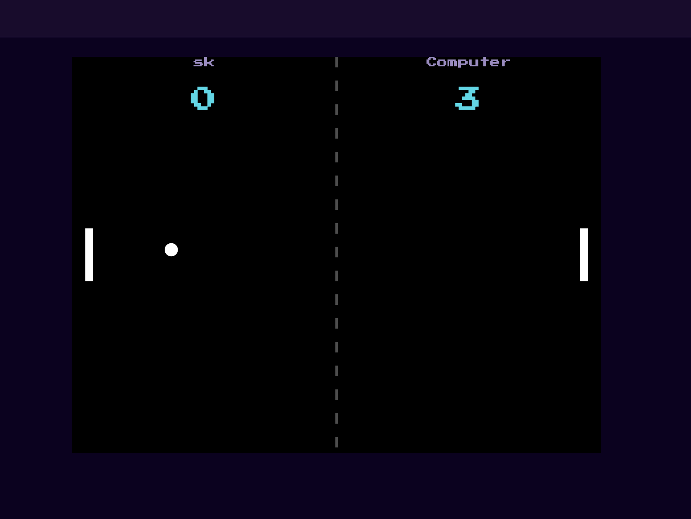

# ai-bot-service

AI opponent for PvE matches — guest play (no account) or solo practice for logged-in users. Connects to gateway-ws as a WebSocket client, same pattern as game-service and match-service: no port of its own, no HTTP server, no inbound connections.

Sessions are fully ephemeral: no `DATABASE_URL`, no persistence of any kind. When a session or connection ends, all bot state for that match is discarded — nothing survives a restart (see Gotchas below for what this means on a crash).

## Messages

### Received (from gateway-ws)

- `ai-bot:sessionStart` — starts tracking a new PvE session: `{ matchId, difficulty, botSide, physicsConfig }`
- `ai-bot:state` (one per game tick) — drives the bot's paddle decisions: `{ matchId, ball, paddles, score }`
- `ai-bot:sessionEnd` — tears down all in-memory state for that session: `{ matchId }`

### Sent (to gateway-ws)

- `game:botInput` (to game-service, type-prefix routing — the prefix names the destination) — the bot's paddle move for the current tick: `{ matchId, direction }`

Difficulty presets (bot behavior only — see Gotchas for what this does *not* control) live in `botConfig.ts`, tuned by playtest rather than fixed — see that file for current values. `easy` additionally misses on purpose ~50% of the time regardless of score.

Difficulty is expressed in two separate phases: how often the bot re-aims (`updateIntervalMs`, gated) versus how often it corrects its direction toward that aim (every physics tick, ungated). The paddle only ever moves at full speed or stops ("bang-bang" controller) and it needs to correct at the real physics cadence or it oscillates regardless of threshold size — only the aim cadence should vary by difficulty.

## Healthcheck

ai-bot-service has no HTTP server. Docker tracks liveness via a file, same pattern as game-service and match-service: `internalClient` writes `/tmp/healthy` when the gateway-ws connection is established and deletes it on disconnect.

```
test: ["CMD-SHELL", "test -f /tmp/healthy"]
```

## Environment variables

- `GATEWAY_WS_URL` (required) — WebSocket URL of gateway-ws to connect to as a client
- `INTERNAL_SERVICE_SECRET` (required) — shared secret used in the `service:register` handshake with gateway-ws

See `.env.example` for the full list with explanatory comments. Note: this service has no native (non-Docker) testing flow — see Local (native) below — so `.env.example` documents the variables for reference, but isn't exercised via a `cp .env.example .env` step the way other services' are.

## Testing

### Unit tests

Independent of Docker — no service needs to be running.

`BotSessionManager.test.ts` and `ballPredictor.test.ts`.

```bash
cd services/ai-bot-service
npm install   # if you don't already have node_modules
npm test
```

3 files and 43 tests should pass.

### Docker (full Compose stack)

See the [root README](../../README.md#prerequisites) — `make up` starts the full stack, `docker ps -a` should show all 9 containers healthy (8 services + postgres). ai-bot-service itself has no `DATABASE_URL` — its own healthcheck doesn't need migrations.

ai-bot-service has no host port mapping — it's only reachable from other containers on `backend-net`, so it can't be checked directly. To confirm it actually works, play a PvE match through the app:

1. Open `https://localhost` in your browser.
2. Play vs AI as a guest from the home page, or log in and pick a difficulty in the Play tab.
3. Watch the opponent paddle for a few seconds without touching any input — it should track the ball and move on its own.

   

No port needs to be uncommented for this — the browser reaches ai-bot-service indirectly, through nginx → gateway-ws → game-service.

### Smoke test

Isolated: `services/ai-bot-service/scripts/smoke-test.mjs` — proves ai-bot-service's own decision logic and WS message contract using synthetic ball/paddle state, no physics loop involved. Registers itself **as `game-service`** with gateway-ws (not `test-service`) — see [gateway-ws's routing](../gateway-ws/README.md#routing): gateway-ws routes service-to-service messages with no fan-out, only to whoever currently holds that name's registration slot, so this script has to occupy it to observe `game:botInput` at all.

**Setup (required — do not skip):**

1. Uncomment gateway-ws's `127.0.0.1:4500:4500` port mapping in the root `docker-compose.yml` (marked `# Native dev only`) — this exposes it to the host.
2. `make up` - also applies migrations automatically.
3. Confirm gateway-ws is up: `docker ps -a` should show `127.0.0.1:4500->4500/tcp`.
4. `docker compose -p mypong stop game-service` — frees the registration slot this script needs to occupy.

> **Skipping this orphans the real container.** gateway-ws keeps one socket per service name; a second registration under `game-service` overwrites the real container's entry immediately, with no error on either side. The healthcheck can't catch this — it only detects a dead process or closed connection, not a live one silently cut out of routing. No auto-recovery. Cleanup step is always needed once this test is done.

**Run:**

```bash
INTERNAL_SERVICE_SECRET=<value> node services/ai-bot-service/scripts/smoke-test.mjs
# or with an explicit URL:
INTERNAL_SERVICE_SECRET=<value> node services/ai-bot-service/scripts/smoke-test.mjs ws://localhost:4500
```

6 cases: internal connection registers as `game-service`, ball above paddle center → `direction: up`, ball below center → `direction: down`, `ai-bot:sessionEnd` tears down state, state for a never-started matchId is silently ignored, clean shutdown.

**Cleanup:** 

The script's own `finally` block only closes its WebSocket — it never calls `docker compose` itself (same contract as every other smoke test in this repo). Restarting the real container is always a manual step.

```bash
docker compose -p mypong start game-service
```

Re-comment gateway-ws's port mapping in the root `docker-compose.yml` and restart the container so the change takes effect:

```bash
docker compose -p mypong start gateway-ws
```

> This isolated test doesn't prove `game:botInput` actually moves a real paddle — no physics loop here to apply it to. For that, see [game-service's smoke test](../game-service/README.md#smoke-test), which chains ai-bot-service's decisions + gateway-ws routing + game-service's physics end-to-end.

### Local (native)

Not applicable. This service has no HTTP server, no host port, and nothing to reach it with except gateway-ws — it only makes sense running inside the Compose network, so there's no faster-iteration native flow like the other WS-client services have.

## Gotchas / known limitations

- **Outbound WS messages are queued in memory while disconnected, not persisted.** `send()` buffers up to 50 pending messages and flushes them in order on reconnect — covering the common case (the 500ms–3s backoff window). High-frequency state broadcasts (`game:state`, `ai-bot:state`) are deliberately excluded from the queue, since a stale tick is superseded by the next one anyway. If the queue fills, the oldest pending message is dropped to make room, with a warning logged. None of this survives a process crash or restart — the queue is memory-only, by design, since this service holds no persistent storage.
- **Ball/paddle speed by difficulty is not configured here.** Difficulty-based physics overrides (easy: `ballInitialSpeed=6`; hard: `ballInitialSpeed=11`, `paddleSpeed=9`) live in game-service's `GameSessionManager.pvePhysicsOverrides()`, isolated from PvP. ai-bot-service only controls bot *behavior* (tracking error, reaction delay, decision cadence) — not ball or paddle speed.
- **No reconnection or rehydration on crash.** If ai-bot-service crashes mid-session, the bot's paddle freezes in place. The human player has to abandon and start a new match — there's no session recovery. Accepted risk at this project's scale, not mitigated.
- **`PhysicsConfig` structural drift (known, unresolved).** The local `PhysicsConfig` interface here has 7 fields; game-service's version has 4 more (`ballInitialSpeed`, `ballMinSpeedFactor`, `ballMaxSpeedFactor`, `maxScore`). Those extra fields arrive over `ai-bot:sessionStart` but are silently discarded — the payload is cast, not structurally validated, so this doesn't surface as a compile error. Flagged for cleanup, not yet fixed.
