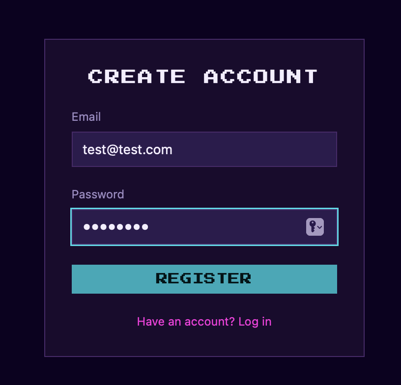
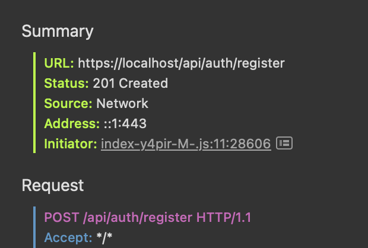

# auth-service

Handles registration, login, token refresh, and logout. Issues short-lived JWT access tokens (15 min) and rotating refresh tokens (7 days) stored in Postgres.

## Endpoints

| Method   | Path        | Description                                     |
|----------|-------------|-------------------------------------------------|
| `POST`   | `/register` | Create account — email + password (argon2 hash); returns access token in body, refresh token as httpOnly cookie, same as `/login` |
| `POST`   | `/login`    | Returns access token in body; refresh token as httpOnly cookie; revokes any previously active refresh tokens for this user (single session per account) |
| `POST`   | `/refresh`  | Returns new access token in body, rotates refresh cookie        |
| `DELETE` | `/session`  | Revokes refresh token (logout)                  |

These paths are without the `/api/auth` prefix — that prefix is added by gateway-api when proxying. Direct calls to auth-service use the bare paths.

**Single session per account.** Each successful `/login` revokes every refresh token row still active for that `user_id` (`revoked_at IS NULL`) before issuing a new one — a second login effectively logs out any other session for the same account. This only happens on `/login`: `/register` has no prior session to revoke, and `/guest` never issues a refresh token at all. The access token from a superseded session keeps working until it expires (up to 15 minutes) or until its own `/refresh` is attempted, whichever comes first — `/refresh` checks `revoked_at` and rejects a revoked token immediately. gateway-ws separately closes the superseded session's WebSocket connection with code `4009` as soon as the new login's connection replaces it — see [gateway-ws's README](../gateway-ws/README.md#single-session-per-user).


## Environment variables

- `PORT` (required) — HTTP port auth-service listens on
- `DATABASE_URL` (required) — Postgres connection string, see `.env.example` for native-flow specifics
- `JWT_SECRET` (required) — signs/verifies access tokens, must match gateway-api and gateway-ws
- `JWT_REFRESH_SECRET` (required) — signs/verifies refresh tokens, known only to auth-service

## Testing

### Unit tests

Independent of the Docker/native choice below — these mock the database and don't need any service running.

```bash
cd services/auth-service
npm install # if you don't already have node_modules
npm test
```
1 file and 18 tests should pass.

### Docker (full Compose stack)

See the [root README](../../README.md#prerequisites) for full setup — `make up` starts the full stack, including the database. Once it's running, `docker ps -a` should show all 9 containers healthy (8 services + postgres).

To verify auth-service works:

1. Open `https://localhost` in your browser.
2. Open DevTools (right-click → Inspect, or `Cmd+Option+I` on Mac).
3. Go to the **Network** tab.
4. Filter to **XHR/Fetch** (not "All") — do this *before* the next step.
5. Register a new account through the UI.
  
6. In the Network tab, click the `register` request and confirm it shows
  `201 Created` under Headers → Summary → Status.

  

No port needs to be uncommented for this — nginx reaches auth-service internally.

> **Note**: You may see a `refresh` request return `401` on first load —
> this is expected. The app always attempts a silent session-restore on
> mount (in case a valid refresh cookie exists from a previous visit); with
> no prior session, it correctly fails and is handled silently.


After registering, the app immediately calls `GET /api/users/me` as part of the normal onboarding flow — see [user-service's README](../user-service/README.md) if you want to verify that flow too.

### Smoke test

Runs against gateway-api (default: `:4010`), not auth-service directly — the refresh cookie has `Path=/api/auth`, which only matches the gateway's `/api/auth/*` routes.

**Setup (once per fresh environment):**

1. Uncomment gateway-api's `127.0.0.1:4010:4000` port mapping in the root `docker-compose.yml` (see [gateway-api's README](../gateway-api/README.md#docker-full-compose-stack)) — this exposes it to the host.
2. `make up`
3. Confirm gateway-api is up: `docker ps -a` should show `127.0.0.1:4010->4000/tcp`.
4. Run migrations (see [root README](../../README.md#prerequisites)) — skip if you already did this for the same DB volume.

**Run:**

```bash
cd services/auth-service
./scripts/smoke-test.sh  # defaults to http://localhost:4010;
```

12 cases: register (new + duplicate + invalid input), login (valid + wrong password), refresh (valid + rotated-token-rejected + after-logout + no-cookie), logout, guest token issuance, and guest token rejected on a protected REST route.

### Local (native, faster iteration)

Use this only if you're actively editing auth-service's own code and want instant reload instead of rebuilding the Docker image on every change.
auth-service runs directly with Node. Postgres runs standalone in Docker on port 5433 (separate from the Compose stack — both can coexist).

This flow uses its own `.env` file, separate from the root one used by Docker:

```bash
cd services/auth-service
cp .env.example .env   # fill in JWT_SECRET and JWT_REFRESH_SECRET. Credentials here must match the docker run command below
```

```bash
# Skip if mypong-pg-dev already exists — check with: docker ps -a
docker run --name mypong-pg-dev \
  -e POSTGRES_DB=mypong -e POSTGRES_USER=mypong_user -e POSTGRES_PASSWORD=dev_password \
  -p 5433:5432 -d postgres:16-alpine

npm install # if not already done for unit tests
set -a && source .env && set +a   # exports DATABASE_URL, JWT_SECRET, etc.
```

> **Warning**: later, if you switch back to `make up` in this same terminal,
> the shell-exported `DATABASE_URL` from the command above will override
> what Docker Compose reads from the root `.env`. Use a different terminal
> for `make up`, or unset these first:
> ```bash
> unset DATABASE_URL JWT_SECRET JWT_REFRESH_SECRET
> ```

```bash
npm run migrate:up
npm run dev   # http://localhost:4001
```

> **Note**: `npm run dev` runs in watch mode and occupies the terminal — it
> won't return your prompt. Open a **second terminal** for the manual check
> below.

Verify manually — this flow has its own isolated database (port 5433, not the Compose one), so `npm run migrate:up` above targets *that* database, not `make up`'s:

```bash
curl -i -X POST http://localhost:4001/register \
  -H "Content-Type: application/json" \
  -d '{"email":"test@example.com","password":"password123"}'
```
Expected: `201` with an `accessToken` in the body. Note the bare path (`/register`, not `/api/auth/register`) — that prefix only exists behind gateway-api.

You can test other endpoints the same way against `http://localhost:4001` (`/login`, `/refresh`, `/session`) — see the Endpoints table above for request shapes. Direct calls here don't carry the cookie path restriction gateway-api has (see Gotchas).

**Cleanup:** stop the native process (`Ctrl+C`) and, if you're done with this flow entirely, remove the standalone Postgres container — it's outside the Compose project, so `make down`/`make fclean` won't touch it:

```bash
docker stop mypong-pg-dev
docker rm mypong-pg-dev
```

## Gotchas

**Refresh cookie requires HTTPS.** The refresh token cookie is set with the `Secure` flag, so browsers only send it back over `https://` — never over plain `http://`. This matches how the stack normally runs (`https://localhost` via nginx), so it isn't an issue in the standard `make up` flow. It only bites if you access the backend over plain HTTP for some reason: `/register` or `/login` will still look like they worked (the response includes `Set-Cookie`), but the browser silently drops it, so `/api/auth/refresh` will keep failing with no obvious error. Workaround for local dev: temporarily set `NODE_ENV: development` in docker-compose.yml (don't commit) to remove the `Secure` flag while debugging.

**Direct calls to `:4001` bypass the cookie path.** The refresh cookie is scoped to `Path=/api/auth`, which only matches gateway-api's routes — not auth-service's bare paths. When testing auth-service directly (not through gateway-api), pass the cookie explicitly: `curl -b "refreshToken=<value>" ...`.