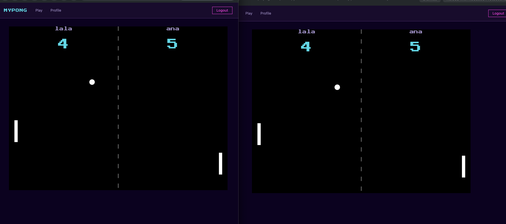

# game-service

Owns the real-time physics of a Pong match while it's in progress: ball, paddles, score, and end conditions. A pure WebSocket client — it connects outbound to gateway-ws at startup and receives match assignments, player input, and session events from there. No database, no REST endpoints, no inbound connections.

## Session lifecycle

1. **Match assigned**: match-service sends `game:assign` with `matchId`, `players` (user IDs mapped to sides), and `startsAt` (an ISO timestamp 3 seconds in the future). game-service records the pending match but does not create a session yet.

2. **Countdown and session creation**: when `startsAt` fires, game-service creates the session and starts the physics tick loop. Any `game:input` arriving before `startsAt` is a safe no-op (the session is not yet in the sessions Map).

3. **Player input**: `game:input` messages from gateway-ws carry an injected `userId`. game-service validates that the user belongs to the match before applying the direction to their paddle. Unknown users are silently ignored.

4. **Player disconnects mid-match**: `game.pause()` halts physics. game-service sends `game:paused` to the opponent with `graceEndsAt` (5 seconds from now). If the player reconnects within the grace window, `game.resume()` is called and `game:resumed` is sent to both. If the deadline expires, the disconnected player forfeits.

> **`game:state` doesn't stop during a pause.** The tick loop broadcasts every frame regardless of `isPaused` — positions freeze, but the messages keep arriving. Don't use `game:state` to detect that a match resumed; only `game:resumed` and `game:end` are reliable phase signals.

5. **Match ends (score)**: when a player reaches the win threshold, game-service sends `game:end` to both players and emits `match:result` so match-service can close the match and persist the result.

6. **Forfeit**: triggered when a player doesn't reconnect within the grace window — whether the disconnect was a network error, closing the tab, or navigating away within the SPA. Also covers a countdown-window disconnect never resolved by `startsAt`. game-service resolves the forfeit at that deadline — sends `game:end` to both players with `reason: 'forfeit'` and the real score, and emits `match:result`.

## Messages

### Received (from gateway-ws)

- `game:assign` (from match-service) — new match assigned: `{ matchId, players, startsAt }`
- `game:input` (from browser, via gateway-ws) — paddle direction: `{ matchId, direction }`, `userId` injected by gateway-ws
- `player:connect` (from gateway-ws) — browser reconnected, triggers resume if within grace window
- `player:disconnect` (from gateway-ws) — browser disconnected, triggers grace timer or forfeit

### Sent (to gateway-ws)

- `game:state` (to both players, `to: [id1, id2]`) — physics snapshot every tick: `{ matchId, ball, paddles, score }`
- `game:paused` (to opponent only, `to: [opponentId]`) — player disconnected: `{ matchId, disconnectedUserId, graceEndsAt }`
- `game:resumed` (to both players, `to: [id1, id2]`) — player reconnected in time: `{ matchId, ball, paddles, score }`
- `game:end` (to both players, `to: [id1, id2]`) — match over: `{ matchId, winnerId, score, reason: 'completed' | 'forfeit' }`
- `match:result` (to match-service, type-prefix routing) — triggers persistence: `{ matchId, players, winnerId, score, status, startedAt, endedAt }`

## Healthcheck

game-service has no HTTP server. Docker tracks liveness via a file: `internalClient` writes `/tmp/healthy` when the gateway-ws connection is established and deletes it on disconnect. The Docker healthcheck is:

```
test: ["CMD-SHELL", "test -f /tmp/healthy"]
```

> **Healthcheck limitation:** `test -f /tmp/healthy` only confirms game-service connected to gateway-ws at some point — not that it currently holds its registration slot. This is a general property of gateway-ws's routing (see its README's "Routing" section), not specific to game-service — but game-service is the one service in this repo with a known trigger for it: ai-bot-service's smoke test deliberately registers as `game-service` to observe `game:botInput` (with its own Setup/Cleanup to do so safely). If that Setup step is skipped, or in the unlikely case anything else registers under this name, the container's socket stays open — `/tmp/healthy` is never deleted and the healthcheck keeps reporting `healthy` while receiving nothing. `docker compose -p mypong restart game-service` recovers it.

## Environment variables

- `GATEWAY_WS_URL` (required) — WebSocket URL of gateway-ws to connect to as a client
- `INTERNAL_SERVICE_SECRET` (required) — shared secret used in the `service:register` handshake with gateway-ws

## Testing

### Unit tests

Independent of Docker — no service needs to be running.

```bash
cd services/game-service
npm install   # if you don't already have node_modules
npm test
```

4 files and 97 tests should pass: `GameSessionManager` (assign/input handling, pause/resume and forfeit grace windows, countdown-window disconnects, voluntary leave, PvE session lifecycle and difficulty-based physics overrides), `Ball` (wall bounce, reverseX, speed clamping, reset), `Game` (initial state, paddle movement and clamping, pause/resume, scoring and serve direction, paddle collision), and the WS internal client (registration, message dispatch, reconnect, health file, pending queue).

To list every test case individually instead of the per-file summary, run Vitest with the verbose reporter:

```bash
npx vitest run --reporter=verbose
```

### Docker (full Compose stack)

See the [root README](../../README.md#prerequisites) — `make up` starts the full stack, `docker ps -a` should show all 9 containers healthy (8 services + postgres). game-service itself has no `DATABASE_URL` — its own healthcheck doesn't need migrations, but the two players used to verify it below do need real accounts.

game-service has no host port mapping — it's only reachable from other containers on `backend-net`, so it can't be checked directly. To verify it works, play a real match through the app:

1. Open `https://localhost` in your browser in two separate windows (or one normal + one private/incognito), and log in as two different accounts.
2. Click **Play** in both, then **Find Match** — both should land in the same match after the 3-second countdown.
3. Move a paddle with the arrow keys in one window and confirm it moves on both screens in real time.

   

No port needs to be uncommented for this — the browser reaches game-service indirectly, through nginx → gateway-ws.

### Smoke test

Requires the full stack running with migrations applied. `INTERNAL_SERVICE_SECRET` must be set in the environment — it is not read from `.env` automatically when running from the repo root.

**Setup (once per fresh environment):**

1. Uncomment gateway-ws's `127.0.0.1:4500:4500` port mapping in the root `docker-compose.yml` (marked `# Native dev only`).
2. Also uncomment gateway-api's `127.0.0.1:4010:4000` port mapping (marked `# Native dev only`) — the smoke test needs it to log in two real players.
3. `make up` - also applies migrations automatically.
4. Confirm both are up: `docker ps -a` should show `127.0.0.1:4500->4500/tcp` and `127.0.0.1:4010->4000/tcp`.

**Run:**

```bash
INTERNAL_SERVICE_SECRET=<value> node services/game-service/scripts/smoke-test.mjs
# or with explicit URLs:
INTERNAL_SERVICE_SECRET=<value> node services/game-service/scripts/smoke-test.mjs ws://localhost:4500 http://localhost:4010
```

15 cases: browser auth (2 players + 1 outsider), internal service registration as `test-service`, `game:assign` delivering `game:state` to both players, initial state shape validation, `game:input` moving the correct paddle, outsider input silently ignored, forfeit by disconnect with correct winner, PvE session assignment for both a logged-in user and a guest (`match:matched` shape only, no wait), one cross-service integration check, `game:startAI` with a retired difficulty value silently rejected, and clean shutdown.

**The cross-service integration check** (guest PvE, ~11.5s wait) is not game-service's own concern in isolation — it chains ai-bot-service's decision logic, gateway-ws's message routing, and game-service's own physics application together and confirms the AI paddle actually moves. It lives in this file rather than in ai-bot-service's own smoke test because gateway-ws routes `game:botInput` with no fan-out — only whoever holds the `game-service` registration slot receives it — so this is the only vantage point where that message's real-world effect is observable at all. See [ai-bot-service's README](../ai-bot-service/README.md#smoke-test) for the isolated counterpart that verifies ai-bot-service's own decision logic without this dependency, and for the full reasoning behind the split.

Note: the smoke test sends `game:assign` without `startsAt` — the session starts immediately (no countdown delay). This is intentional for isolation; the real countdown flow is covered by unit tests with fake timers.

**Cleanup:** re-comment gateway-api's port mapping in the root `docker-compose.yml`, then recreate the container so the change takes effect (`start` reuses the existing container as-is; `up -d` recreates it, which is required to pick up a docker-compose.yml edit like this one). If you're **not** continuing to Local (native) below, also re-comment gateway-ws's port mapping and recreate that container the same way:

```bash
docker compose -p mypong up -d gateway-api
docker compose -p mypong up -d gateway-ws   # only if you re-commented its port too
```

### Local (native, faster iteration)

Use this only if you're actively editing game-service's own code and want instant reload instead of rebuilding the Docker image on every change.

game-service connects outbound to gateway-ws — only gateway-ws needs to be reachable. 

**Setup (once per fresh environment):**

1. gateway-ws's port may already be uncommented if you just ran the Smoke test above — if not, uncomment gateway-ws's `127.0.0.1:4500:4500` port mapping in the root `docker-compose.yml` (marked `# Native dev only`) — the native process needs to reach it from the host.
2. `make up`
3. Confirm gateway-ws is up: `docker ps -a` should show `127.0.0.1:4500->4500/tcp`.
4. Stop just the game-service container (leave gateway-ws and the rest running):

```bash
docker compose -p mypong stop game-service
```

**Run:**

```bash
cd services/game-service
cp .env.example .env   # fill in INTERNAL_SERVICE_SECRET — copy the value from the root .env
npm install             # if not already done for unit tests
set -a && source .env && set +a
npm run dev             # connects to GATEWAY_WS_URL on start; /tmp/healthy written when connected
```
> **Note**: `npm run dev` runs in watch mode and occupies the terminal — it
> won't return your prompt. Open a **second terminal** for the manual check
> below (and don't source this service's `.env` there, to avoid the
> shadowing risk noted next).

> **Warning**: if you sourced `.env` here and then switch to `make up` in the same terminal, the shell-exported variables override what Docker Compose reads from the root `.env`. Open a new terminal for `make up`, or unset the variables first:
> ```bash
> unset GATEWAY_WS_URL INTERNAL_SERVICE_SECRET
> ```

**Verify manually**, from that second terminal:

```bash
ls -la /tmp/healthy   # shows a 0-byte file if connected to gateway-ws; "No such file or directory" if not
```

If it doesn't exist, check the first terminal for repeating `gateway-ws connection error` lines — that means gateway-ws's port isn't actually reachable (see Setup above).

**Cleanup:** stop the native process (`Ctrl+C`), re-comment gateway-ws's port mapping in the root `docker-compose.yml`, then restart both containers so the changes take effect (`start` alone won't pick up a docker-compose.yml edit):

```bash
docker compose -p mypong start game-service
docker compose -p mypong up -d gateway-ws
```

## Gotchas / known limitations

- **Outbound WS messages are queued in memory while disconnected, not persisted.** `send()` buffers up to 50 pending messages and flushes them in order on reconnect — covering the common case (the 500ms–3s backoff window). High-frequency state broadcasts (`game:state`, `ai-bot:state`) are deliberately excluded from the queue, since a stale tick is superseded by the next one anyway. If the queue fills, the oldest pending message is dropped to make room, with a warning logged. None of this survives a process crash or restart — the queue is memory-only, by design, since this service holds no persistent storage.