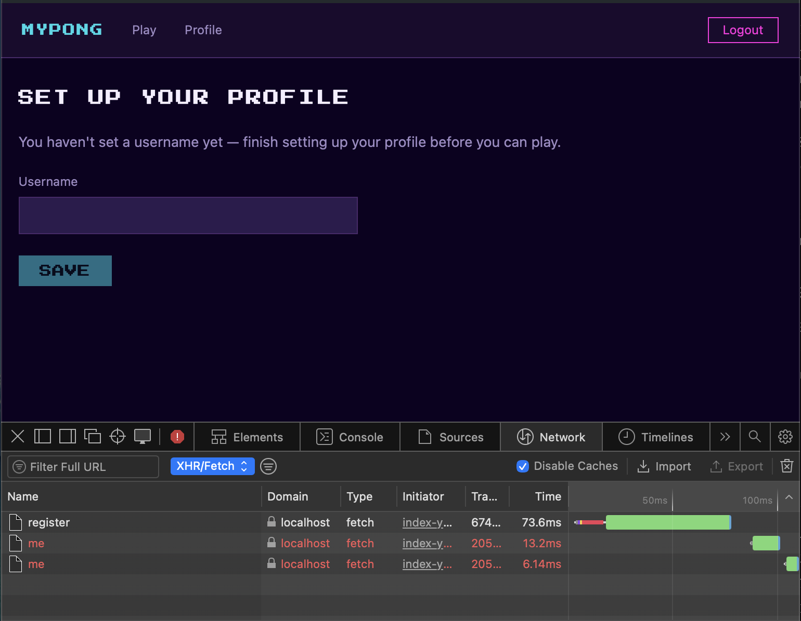

# gateway-api

REST gateway: validates JWT access tokens and proxies authenticated requests to upstream services. The only entry point for the frontend — no business logic, no database.

## Endpoints

All routes are under `/api/`. Public routes pass through without JWT validation; protected routes require a valid `Authorization: Bearer <access_token>` header.

| Method   | Path                     | Target       | Auth required |
|----------|--------------------------|--------------|---------------|
| `GET`    | `/health`                | gateway-api  | No            |
| `POST`   | `/api/auth/register`     | auth-service | No            |
| `POST`   | `/api/auth/login`        | auth-service | No            |
| `POST`   | `/api/auth/refresh`      | auth-service | No            |
| `DELETE` | `/api/auth/session`      | auth-service | No            |
| `GET`    | `/api/users/me`          | user-service | **Yes**       |
| `PATCH`  | `/api/users/me`          | user-service | **Yes**       |
| `POST`   | `/api/users/me/avatar`   | user-service | **Yes**       |
| `GET`    | `/api/users/:id/stats`   | user-service | **Yes**       |
| `GET`    | `/api/users/:id/matches` | user-service | **Yes**       |

The `/api/auth` prefix is stripped before proxying — auth-service receives `/register`, `/login`, etc. (see [auth-service README](../auth-service/README.md)).
The `/api/users` prefix is stripped similarly — user-service receives `/me`, `/:id/stats`, etc.

## Environment variables

- `PORT` (required) — HTTP port gateway-api listens on
- `JWT_SECRET` (required) — must match auth-service, used to verify access tokens
- `AUTH_SERVICE_URL` (required) — base URL to proxy `/api/auth/*` to
- `USER_SERVICE_URL` (required) — base URL to proxy `/api/users/*` to

## Testing

### Unit tests

Independent of the Docker/native choice below — these mock the JWT plugin and the upstream proxy, no service needs to be running.

```bash
cd services/gateway-api
npm install # if you don't already have node_modules
npm test
```

4 files and 39 tests should pass.

### Docker (full Compose stack)

See the [root README](../../README.md#prerequisites) — `make up` starts the full stack, `docker ps -a` should show all 9 containers healthy (8 services + postgres).

gateway-api is normally reached only through nginx (`/api/*`) — the browser never talks to it directly. To verify gateway-api works, use the app itself, since every REST call in the app goes through it:

1. Open `https://localhost` in your browser.
2. Open DevTools, go to **Network**, filter to **XHR/Fetch** — do this *before* the next step.
3. Register a new account through the UI.
4. Confirm you see `register` return `201`, followed by two `me` calls in
   red (`404`) — this is expected: registering redirects straight to the
   Profile page, which immediately checks for an existing profile before
   one has been created. Seeing gateway-api route these calls to both
   auth-service and user-service confirms it's working correctly.

   

No port needs to be uncommented for this — nginx reaches gateway-api internally.

### Smoke test

Runs against gateway-api directly (default: `:4010`) — tests JWT validation and routing, not auth-service's own logic (that's covered by the auth-service smoke test).

**Setup (once per fresh environment):**

1. Uncomment gateway-api's `127.0.0.1:4010:4000` port mapping in the root `docker-compose.yml` (marked `# Native dev only`) — this exposes it to the host.
2. `make up`
3. Confirm gateway-api is up: `docker ps -a` should show `127.0.0.1:4010->4000/tcp`.

**Run:**

```bash
cd services/gateway-api
./scripts/smoke-test.sh http://localhost:4010
```

4 cases: health check and three JWT deny cases (`/api/users/me` without auth, with malformed token, without Bearer prefix). Auth flow is covered by the auth-service smoke test.

### Local (native)

Use this only if you're actively editing gateway-api's own code and want instant reload instead of rebuilding the Docker image on every change.
gateway-api runs directly with Node; auth-service and Postgres run via `make up`. user-service has no native flow, so it stays in Docker regardless — `/api/users/*` routes won't be reachable while gateway-api runs natively, since it always proxies those to user-service over the Docker network only.

**Setup (once per fresh environment):**

1. Uncomment auth-service's `127.0.0.1:4001:4001` port mapping in the root `docker-compose.yml` (marked `# Native dev only`) — gateway-api's `.env.example` points `AUTH_SERVICE_URL` at `http://localhost:4001`; without this, every request through the native gateway-api fails with connection refused.
2. `docker compose -p mypong up -d auth-service`
3. `docker compose -p mypong stop gateway-api` — frees the port for the native process.
4. Run migrations (see [root README](../../README.md#prerequisites)) — skip if you already did this for the same DB volume.

This flow uses its own `.env` file, separate from the root one used by Docker:

```bash
cd services/gateway-api
cp .env.example .env   # fill in JWT_SECRET — must match auth-service/.env
```

```bash
npm install # if not already done for unit tests
set -a && source .env && set +a
npm run dev   # http://localhost:4000 (or 4010 if PORT=4010 in .env)
```

> **Note**: `npm run dev` runs in watch mode and occupies the terminal — it
> won't return your prompt. Open a **second terminal** for the manual check
> below (and don't source this service's `.env` there, to avoid the
> shadowing risk noted next).

> **Warning**: same shell-export risk as in
> [auth-service](../auth-service/README.md#local-native-faster-iteration) —
> sourcing `.env` here and then running `make up` in the same terminal can
> shadow the root `.env`. Open a new terminal for `make up`, or unset first:
> ```bash
> unset PORT JWT_SECRET AUTH_SERVICE_URL
> ```

Verify manually, from that second terminal — use the port shown in the server's startup log (`Server listening at http://127.0.0.1:<PORT>`), it matches the `PORT` set in your `.env`. Replace the placeholder `<PORT>` below with that number (e.g.`4000` by default):

```bash
curl -i -X POST http://localhost:<PORT>/api/auth/login -H "Content-Type: application/json" -d '{"email":"test@example.com","password":"wrongpassword"}'
```

Expected: `401 { "error": "Invalid credentials" }` — confirms gateway-api (native) is correctly reaching auth-service (Docker) through the uncommented port.

You can also point `./scripts/smoke-test.sh http://localhost:<PORT>` at this native instance for the same automated checks.

**Cleanup:** stop the native process (`Ctrl+C`), re-comment auth-service's port mapping in the root `docker-compose.yml`, then recreate both containers so the changes take effect:

```bash
docker compose -p mypong up -d auth-service   # picks up the re-commented port
docker compose -p mypong start gateway-api    # was stopped in Setup step 3
```