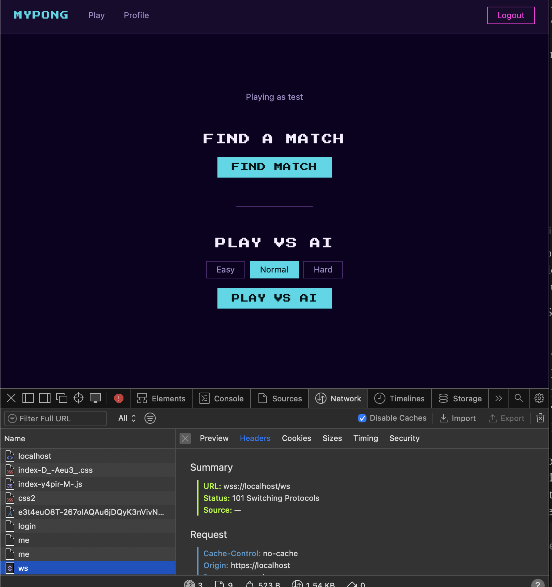

# gateway-ws

WebSocket hub: authenticates browser connections via JWT, authenticates internal service connections via shared secret, and routes messages between them. No database, no REST endpoints — stateless except for open socket handles. The only HTTP endpoint is `/health` for the Docker healthcheck.

## Browser connection

Browsers connect to `wss://<host>/ws` through nginx, which terminates TLS and proxies the upgrade to gateway-ws. **Do not connect to port 4500 directly in production** — the port mapping in `docker-compose.yml` is commented out by default and only meant for native-dev testing (see Testing below).

| Step |     Direction   |              Message                  |
|------|-----------------|---------------------------------------|
|   1  | Client → Server | TCP + WebSocket upgrade (no auth yet) |
|   2  | Client → Server | `{ "type": "auth", "payload": { "token": "<access_token>" } }` |
|   3  | Server → Client | `{ "type": "connected", "payload": { "userId": <id> } }`|

If authentication fails, the server closes the socket with one of these codes (application-reserved range per RFC 6455):

|   Code |        Reason       |
|--------|---------------------|
| `4001` | Unauthorized — token missing, invalid, expired, wrong type, or 5s timeout exceeded without sending an auth message |
| `4003` | Bad Request — first message is not valid JSON, or does not have the required `{ type, payload.token }` shape |
| `4009` | Session Replaced — a newer browser connection authenticated with the same `userId` (see "Single session per user" below) |

The `type` claim in the token is verified in addition to the signature — a refresh token is rejected even if the secret matches, as a defense against misconfiguration.

## Single session per user

gateway-ws maintains one browser socket per `userId`. A second connection authenticating with the same `userId` closes the previous one with code `4009` — synchronously, before registering the new one, so there's never a gap with no valid connection. See [auth-service's README](../auth-service/README.md#single-session-per-account) for the other half of this mechanism (refresh token revocation on login).

## Internal service connection

Backend services (game-service, match-service, user-service, ai-bot-service) connect to gateway-ws at startup using a shared secret, not a JWT — same auth-by-first-message protocol as browsers (5s timeout, code 4001 on failure).

| Step  |      Direction       |        Message 
|-------|----------------------|----------------------------------------------------
| 1     | Service → gateway-ws | TCP + WebSocket upgrade 
| 2     | Service → gateway-ws | `{ "type": "service:register", "service": "<name>", "token": "<INTERNAL_SERVICE_SECRET>" }`
| 3     | gateway-ws → Service | `{ "type": "registered" }` — connection is now authenticated

`service` must be one of the known names: `game-service`, `match-service`, `user-service`, `ai-bot-service`, `test-service` (reserved for smoke tests). Any other name is rejected with code 4001.

## Routing

gateway-ws routes messages between browsers and services with no business logic — it never modifies payloads.

**Service → browser fan-out** (`to` field): a service message with a `to: number[]` field is delivered to each userId in the array. The `to` field is stripped before delivery. This is how services push game events to specific browser clients.

**Service → service (type-prefix routing)**: a service message without a `to` field is routed by the prefix before the first `:` in the `type` field — e.g. `match:result` routes to `match-service`, `game:assign` routes to `game-service`. The prefix always names the **destination**, not the sender — `match:result` above is sent *by* game-service, not match-service. No rewriting of `type` or payload.

**Browser → service (userId injection)**: gateway-ws injects the authenticated `userId` into every message received from a browser before forwarding it to the target service (derived from the validated JWT, never from the payload). A client-supplied `userId` in the message body is ignored.

## Healthcheck

gateway-ws serves a plain HTTP `GET /health` endpoint on the same port as its WebSocket server (4500), returning `200` as long as the server is listening. The Docker healthcheck is:

```
test: ["CMD", "wget", "-qO-", "http://127.0.0.1:4500/health"]
```

## Environment variables

- `PORT` (required) — HTTP port gateway-ws listens on
- `JWT_SECRET` (required) — must match auth-service, used to verify browser access tokens
- `INTERNAL_SERVICE_SECRET` (required) — shared secret used by internal services to authenticate

## Testing

### Unit tests

Independent of Docker — no service needs to be running. Tests use a real `WebSocketServer` on an OS-assigned port and real JWT tokens; nothing is mocked.

```bash
cd services/gateway-ws
npm install   # if you don't already have node_modules
npm test
```

3 files and 34 tests should pass: WebSocket auth (valid/guest/refresh/wrong-secret/expired tokens, timeout, malformed first message, health endpoint), service registration and routing (register success/deny cases, stale-close safety, browser→service userId injection, service→browser fan-out, service→service routing, presence broadcast on connect/disconnect), and single-session replacement (4009 close, ordering of disconnect-before-connect broadcasts, unaffected sessions for other userIds).

### Docker (full Compose stack)

See the [root README](../../README.md#prerequisites) — `make up` starts the full stack (also applies migrations automatically), `docker ps -a` should show all 9 containers healthy (8 services + postgres).

gateway-ws is normally reached only through nginx (`wss://<host>/ws`) — the browser never connects to port 4500 directly. To verify gateway-ws works, use the app itself:

1. Open `https://localhost` in your browser.
2. Open DevTools → **Network** → filter to **All**  — do this *before* the next step.
3. To trigger the WS connection, either log in and click **Play** (connection opens when the page mounts), 
   or use **Play vs AI** as a guest from the home page (connection opens on the **Play vs AI** click).
4. Confirm you see a `ws` entry with status `101`. Click it to see the message frames: **Preview** tab 
   in Safari, **Messages** tab in Chrome. Either way, confirm `{"type":"auth",...}` sent and `{"type":"connected",...}` received.
  

No port needs to be uncommented for this — nginx reaches gateway-ws internally.

### Smoke test

Talks to gateway-ws directly (`:4500`) to test the WS auth protocol, and to gateway-api (`:4010`) to obtain a real JWT for the valid-token case.

**Setup (once per fresh environment):**

1. Uncomment gateway-ws's `127.0.0.1:4500:4500` port mapping in the root `docker-compose.yml` (marked `# Native dev only`).
2. Also uncomment gateway-api's `127.0.0.1:4010:4000` port mapping (marked `# Native dev only`) — the smoke test needs it to fetch a real access token.
3. `make up`
4. Confirm both are up: `docker ps -a` should show `127.0.0.1:4500->4500/tcp` and `127.0.0.1:4010->4000/tcp`.

**Run:**

```bash
node services/gateway-ws/scripts/smoke-test.mjs
# or with explicit URLs:
node services/gateway-ws/scripts/smoke-test.mjs ws://localhost:4500 http://localhost:4010
```

3 cases: valid token (connects), invalid token (deny, 4001), no auth sent (deny, 4001 after 5s timeout — this case takes ~5 seconds).

> **Note**: the script registers as `test-service`, never a real service
> name — a second registration under a real name silently orphans that
> service from routing (see "Internal service connection" above), with no
> error and no automatic recovery.

**Cleanup:** re-comment gateway-api's port mapping in the root `docker-compose.yml`, then recreate the container so the change takes effect (`start` reuses the existing container as-is; `up -d` recreates it, which is required to pick up a docker-compose.yml edit like this one). If you're **not** continuing to Local (native) below, also re-comment gateway-ws's port mapping and recreate that container the same way:

```bash
docker compose -p mypong up -d gateway-api
docker compose -p mypong up -d gateway-ws   # only if you re-commented its port too
```

### Local (native)

Use this only if you're actively editing gateway-ws's own code and want instant reload instead of rebuilding the Docker image on every change.

**Setup (once per fresh environment):**

gateway-ws's port is commented out by default, so this needs no setup — unless you left it uncommented from the Smoke test above, in which case free it first:

```bash
docker compose -p mypong stop gateway-ws
```

**Run:**

```bash
cd services/gateway-ws
cp .env.example .env   # fill in JWT_SECRET and INTERNAL_SERVICE_SECRET — must match the root .env values
npm install   # if not already done for unit tests
set -a && source .env && set +a
npm run dev   # ws://localhost:4500
```

> **Note**: `npm run dev` runs in watch mode and occupies the terminal — it
> won't return your prompt. Open a **second terminal** for the manual check
> below (and don't source this service's `.env` there, to avoid the
> shadowing risk noted next).

> **Warning**: same shell-export risk as
> [auth-service](../auth-service/README.md#local-native-faster-iteration) —
> sourcing `.env` here and then running `make up` in the same terminal can
> shadow the root `.env`. Open a new terminal for `make up`, or unset first:
> ```bash
> unset PORT JWT_SECRET INTERNAL_SERVICE_SECRET
> ```

**Verify manually**, from that second terminal — this bypasses nginx entirely (no TLS, no `/ws` path), talking to the native process instead.

**1. Get an access token** (full stack running in Docker, migrations applied):

```bash
curl -sk -X POST https://localhost/api/auth/register \
  -H 'Content-Type: application/json' \
  -d '{"email":"ws-test@example.com","password":"Test1234!"}'

TOKEN=$(curl -sk -X POST https://localhost/api/auth/login \
  -H 'Content-Type: application/json' \
  -d '{"email":"ws-test@example.com","password":"Test1234!"}' \
  | grep -o '"accessToken":"[^"]*"' | cut -d'"' -f4)

echo $TOKEN   # confirm it's non-empty
```

**2. Connect directly to the native process** (install wscat once if needed: `npm install -g wscat`):

```bash
wscat -c ws://localhost:4500
```

**3. Once connected, modify and paste the following auth message. Do this within 5 seconds:**

```json
{"type":"auth","payload":{"token":"<paste TOKEN here>"}}
```

**Expected response:**

```json
{"type":"connected","payload":{"userId":"<your user id>"}}
```

If the 5-second window passes before sending, the server closes with code 4001 — reconnect and paste faster.

> **Comparing against nginx:** the Docker section's browser check proves
> the full production path (browser → nginx → gateway-ws). If that fails
> but this native check succeeds, the bug is in `nginx.conf`'s `/ws` block,
> not gateway-ws itself.

**Cleanup:** stop the native process (`Ctrl+C`) and, if you uncommented gateway-ws's port mapping, re-comment it and recreate the Docker container so the change takes effect (`start` reuses the existing container as-is; `up -d` recreates it, which is required to pick up a docker-compose.yml edit like this one):

```bash
docker compose -p mypong up -d gateway-ws
```

## Gotchas / known limitations

**A duplicate service registration silently orphans the previous one.** A second `service:register` under an already-registered name immediately overwrites the routing entry — the previous socket stays open but no longer receives anything, with no error on either side and no automatic recovery. The file-based healthchecks of the affected services don't detect it (their connection never closed). Recovery is manual: `docker compose -p mypong restart <service>`. This is why smoke tests register as `test-service`, never a real name — with one deliberate, documented exception in [ai-bot-service's README](../ai-bot-service/README.md#smoke-test).
