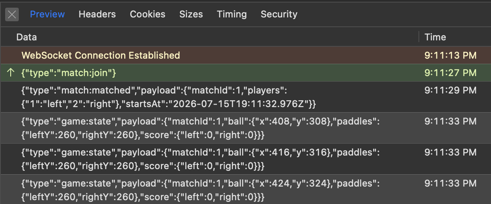

# match-service

Owns the match lifecycle: FIFO matchmaking queue, match creation in Postgres, and match closure (persisting result and emitting history events). A pure WebSocket client — it connects outbound to gateway-ws at startup and receives matchmaking and game events from there. No HTTP endpoints; healthcheck is file-based.

## Matchmaking and match lifecycle

**Queue**: on `match:join`, match-service checks whether the user already has an active match (`findActiveMatchForUser`) and sends `match:rejected` if so. Otherwise the user is added to the FIFO queue. On `match:cancel` or `player:disconnect`, the user is silently removed.

**Pairing**: when two players are queued, match-service dequeues both, calls `createMatch()` to insert a `match` row, and computes `startsAt` once (`Date.now() + 3s`). Two messages are sent in the same tick: `match:matched` fan-out to both browsers and `game:assign` routed to game-service — both carry the same `startsAt` value so the countdown is synchronized.

**Closure**: on `match:result` from game-service, match-service calls `closeMatch()` to update the match row (`scores`, `winner_id`, `status`, `closed_at`) and then emits `user:matchRecorded` to user-service. `user:matchRecorded` is only emitted after a successful `closeMatch()` — never on failure.

## Database

| Column | Type | Notes |
|--------|------|-------|
| `id` | serial (PK) | |
| `player1_id` | integer | No FK — cross-service FK would couple match-service to auth-service's schema |
| `player2_id` | integer | |
| `player1_score` | integer | Null until match is closed |
| `player2_score` | integer | |
| `winner_id` | integer | Null until match is closed |
| `status` | text | `'active'` on creation; `'completed'` or `'forfeit'` on closure |
| `created_at` | timestamp | Set by `now()` on insert |
| `closed_at` | timestamp | Null until match is closed |

Migrations table: `pgmigrations_match`.

## Messages

### Received (from gateway-ws)

- `match:join` (from browser, via gateway-ws) — enqueue user: rejected with `match:rejected` if already in an active match, or if the user is a guest (negative `userId`)
- `match:cancel` (from browser, via gateway-ws) — remove user from queue (no-op if not queued)
- `player:disconnect` (from gateway-ws) — remove disconnected user from queue
- `match:result` (from game-service, type-prefix routing) — final scores: triggers `closeMatch()` and `user:matchRecorded`

### Sent (to gateway-ws)

- `match:matched` (to both players, `to: [id1, id2]`) — match found: `{ matchId, players, startsAt }`
- `match:rejected` (to requester, `to: [userId]`) — `{ reason: 'already_in_match', message }` if already in an active match, or `{ reason: 'guest_not_allowed', message }` for a guest attempting PvP matchmaking — the guest check runs before the active-match lookup, so a guest never touches the database
- `game:assign` (to game-service, type-prefix routing) — same payload as `match:matched`, triggers session creation in game-service
- `user:matchRecorded` (to user-service, type-prefix routing) — same shape as `match:result`, triggers stats/history recording in user-service

## Healthcheck

match-service has no HTTP server. Docker tracks liveness via a file: `internalClient` writes `/tmp/healthy` when the gateway-ws connection is established and deletes it on disconnect. The Docker healthcheck is:

```
test: ["CMD-SHELL", "test -f /tmp/healthy"]
```

## Environment variables

- `DATABASE_URL` (required) — PostgreSQL connection string
- `GATEWAY_WS_URL` (required) — WebSocket URL of gateway-ws to connect to as a client — `ws://gateway-ws:4500` in Docker, `ws://localhost:4500` in native dev
- `INTERNAL_SERVICE_SECRET` (required) — shared secret used in the `service:register` handshake with gateway-ws

## Testing

### Unit tests

Independent of Docker — no service needs to be running.

```bash
cd services/match-service
npm install   # if you don't already have node_modules
npm test
```

4 files and 37 tests should pass: the matchmaking queue (FIFO pairing, duplicate-join guard, guest rejection, cancel, disconnect cleanup), `match.service` (createMatch, closeMatch, findActiveMatch), the `matchResult` handler, and the WS internal client.

### Docker (full Compose stack)

See the [root README](../../README.md#prerequisites) — `make up` starts the full stack (also applies migrations automatically), `docker ps -a` should show all 9 containers healthy (8 services + postgres).

match-service has no host port mapping — it's only reachable from other containers on `backend-net`, so it can't be checked directly. To verify it works, pair two players through the app:

1. Open `https://localhost` in your browser in two separate windows (or one normal + one private/incognito), and log in as two different accounts.
2. Open DevTools → **Network** → filter to **WS** in both windows — do this *before* the next step.
3. Click **Play** in both, then **Find Match**.
4. Click the `ws` entry in each window's Network tab to see the message frames (**Preview** tab in Safari, **Messages** tab in Chrome). Confirm `{"type":"match:join"}` sent and `{"type":"match:matched",...}` received, with matching `matchId` and complementary `players` sides (`left`/`right`) in both windows.

   

No port needs to be uncommented for this — the browser reaches match-service indirectly, through nginx → gateway-ws.

### Smoke test

Requires the full stack running with migrations applied.

**Setup (once per fresh environment):**

1. Uncomment gateway-ws's `127.0.0.1:4500:4500` port mapping in the root `docker-compose.yml` (marked `# Native dev only`).
2. Also uncomment gateway-api's `127.0.0.1:4010:4000` port mapping (marked `# Native dev only`) — the smoke test needs it to log in two real players.
3. `make up` - also applies migrations automatically.
4. Confirm both are up: `docker ps -a` should show `127.0.0.1:4500->4500/tcp` and `127.0.0.1:4010->4000/tcp`.

> match-service's smoke test only authenticates as browsers (via gateway-api) — it never registers itself as an internal service, so unlike game-service's and ai-bot-service's smoke tests, `INTERNAL_SERVICE_SECRET` is not required to run it.

**Run:**

```bash
node services/match-service/scripts/smoke-test.mjs
# or with explicit URLs:
node services/match-service/scripts/smoke-test.mjs ws://localhost:4500 http://localhost:4010
```

9 cases: browser1 authenticates, browser2 authenticates, `match:join` pairing both players into `match:matched` (correct matchId and side assignments), `match:cancel` preventing a match from being made, `match:rejected` for an already-matched user (shape: `reason: 'already_in_match'`, message present), rejection not re-enqueuing the user, a guest's `match:join` rejected with `match:rejected` (shape: `reason: 'guest_not_allowed'`, message present), two guests joining back-to-back never producing `match:matched` for either one, and clean shutdown.

> **Known side effect**: the smoke test leaves a `match:result` with `status: 'forfeit'` and score `0–0` in `user_match_history` when the sockets close after `match:matched` — the disconnect mid-match triggers the same forfeit path as a real disconnection. This is pre-existing game-service behavior that becomes visible here now that user-service consumes `user:matchRecorded`.

### Local (native, faster iteration)

Use this only if you're actively editing match-service's own code and want instant reload instead of rebuilding the Docker image on every change.

match-service connects outbound to gateway-ws and Postgres — no FK dependencies on auth-service's schema, so it can run with a standalone Postgres instance alongside the rest of the Docker stack. 

**Setup (once per fresh environment):**

1. Uncomment gateway-ws's `127.0.0.1:4500:4500` port mapping in the root `docker-compose.yml` (marked `# Native dev only`) — the native process needs to reach it from the host.
2. `make up`
3. Confirm gateway-ws is up: `docker ps -a` should show `127.0.0.1:4500->4500/tcp`.
4. Stop just the match-service container (leave gateway-ws and the rest running):

```bash
docker compose -p mypong stop match-service
```

5. Start a standalone Postgres instance for the native process — skip if `mypong-pg-dev` already exists (check with `docker ps -a`; it's the same shared container documented in [auth-service's README](../auth-service/README.md#local-native-faster-iteration)):

```bash
docker run --name mypong-pg-dev \
  -e POSTGRES_DB=mypong -e POSTGRES_USER=mypong_user -e POSTGRES_PASSWORD=dev_password \
  -p 5433:5432 -d postgres:16-alpine
```

**Run:**

```bash
cd services/match-service
cp .env.example .env   # fill in INTERNAL_SERVICE_SECRET — copy the value from the root .env
npm install             # if not already done for unit tests
set -a && source .env && set +a
npm run migrate:up
npm run dev             # connects to GATEWAY_WS_URL on start; /tmp/healthy written when connected
```

> **Note**: `npm run dev` runs in watch mode and occupies the terminal — it
> won't return your prompt. Open a **second terminal** for the manual check
> below (and don't source this service's `.env` there, to avoid the
> shadowing risk noted next).

> **Warning**: if you sourced `.env` here and then switch to `make up` in the same terminal, the shell-exported variables override what Docker Compose reads from the root `.env`. Open a new terminal for `make up`, or unset the variables first:
> ```bash
> unset DATABASE_URL GATEWAY_WS_URL INTERNAL_SERVICE_SECRET
> ```

**Verify manually**, from that second terminal:

```bash
ls -la /tmp/healthy   # shows a 0-byte file if connected to gateway-ws; "No such file or directory" if not
```

**Cleanup:** stop the native process (`Ctrl+C`), re-comment gateway-ws's port mapping in the root `docker-compose.yml`, then restart both containers so the changes take effect. The standalone `mypong-pg-dev` container is shared with auth-service's native flow — leave it running unless you're done with native dev entirely (see [auth-service's README](../auth-service/README.md#local-native-faster-iteration) for removing it):


```bash
docker compose -p mypong start match-service
docker compose -p mypong up -d gateway-ws
```

## Gotchas / known limitations

- **Outbound WS messages are queued in memory while disconnected, not persisted.** `send()` buffers up to 50 pending messages and flushes them in order on reconnect — covering the common case (the 500ms–3s backoff window). High-frequency state broadcasts (`game:state`, `ai-bot:state`) are deliberately excluded from the queue, since a stale tick is superseded by the next one anyway. If the queue fills, the oldest pending message is dropped to make room, with a warning logged. None of this survives a process crash or restart — the queue is memory-only, by design, since match-service's only persistent storage is `DATABASE_URL` for the `match` table itself, not for this outbound message queue.
