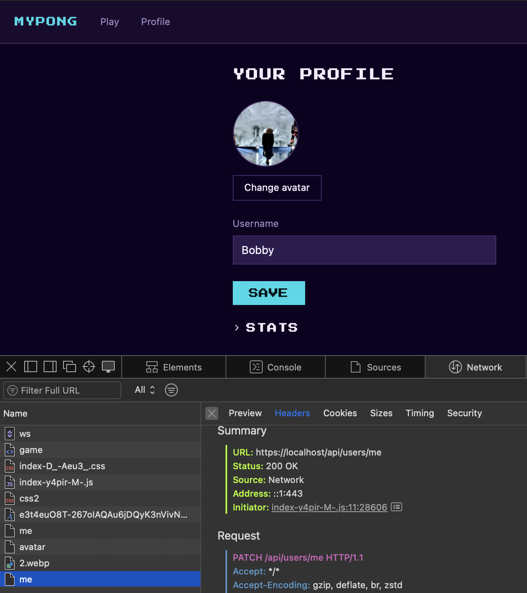
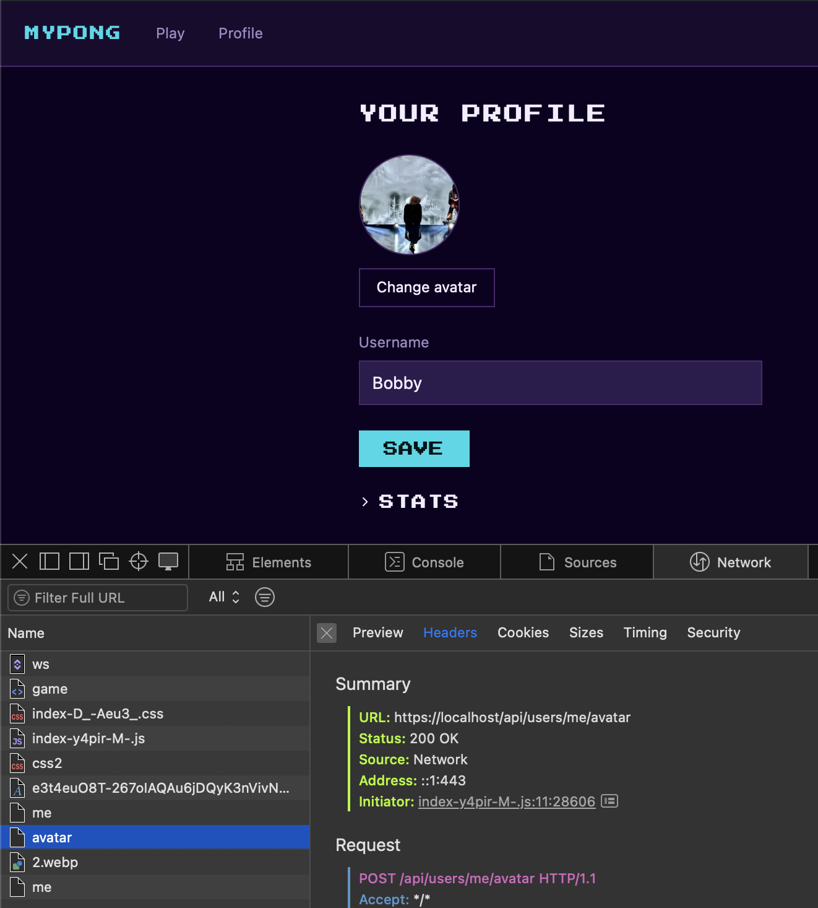

# user-service

Manages user profiles, avatar uploads, and match statistics. It's mostly a REST API — profile reads and writes go through HTTP like any other service — but it also connects to gateway-ws as an internal WebSocket client, so it can listen for `user:matchRecorded` events and keep stats and match history up to date in real time. That connection is automatic on boot; there's nothing to configure or trigger manually on the WS side.

## Endpoints

All paths below are relative to `/api/users/*`, since gateway-api proxies everything under that prefix. Clients authenticate with a normal `Authorization: Bearer <access_token>` header, same as any other protected route. gateway-api validates that token and then talks to user-service internally over `x-user-id` — user-service itself never sees or decodes the JWT, it just trusts that header.

| Method   | Path            | Auth required | Description                                                       
|----------|-----------------|---------------|-------------------------------------------------------------------
| `GET`    | `/?ids=1,2,3`   | Yes           | Batch profile lookup (max 50 ids); unknown/profile-less ids silently omitted 
| `GET`    | `/me`           | Yes           | Returns own profile; `404` if no profile row yet                  
| `PATCH`  | `/me`           | Yes           | Creates or updates username (first call creates the profile row)  
| `POST`   | `/me/avatar`    | Yes           | Multipart upload; resizes to 512×512 WebP; requires prior PATCH   
| `GET`    | `/:id/stats`    | Yes           | Any user's stats; returns zeroed defaults if no matches recorded  
| `GET`    | `/:id/matches`  | Yes           | Any user's match history; `?limit=` (max 50) `?offset=` (default 20/0)

## Database

| Table | Column | Type | Notes |
|-------|--------|------|-------|
| `user_profiles` | `user_id` | integer (PK) | FK → `users.id`, `ON DELETE CASCADE` |
| | `username` | text (unique) | Nullable until the first successful `PATCH /me` |
| | `avatar_url` | text | Nullable until the first successful avatar upload |
| `user_stats` | `user_id` | integer (PK) | FK → `users.id`, `ON DELETE CASCADE` |
| | `games_played` | integer | `NOT NULL DEFAULT 0` |
| | `games_won` | integer | `NOT NULL DEFAULT 0` |
| | `highest_score` | integer | `NOT NULL DEFAULT 0` |
| | `updated_at` | timestamptz | `NOT NULL DEFAULT NOW()` |
| `user_match_history` | `id` | serial (PK) | |
| | `user_id` | integer | `NOT NULL`, FK → `users.id`, `ON DELETE CASCADE` |
| | `match_id` | integer | `NOT NULL` — no FK to `match`, same cross-service-FK avoidance as match-service |
| | `opponent_id` | integer | `NOT NULL` |
| | `result` | text | `NOT NULL`, `CHECK (result IN ('win', 'loss'))` |
| | `my_score` | integer | `NOT NULL` |
| | `opp_score` | integer | `NOT NULL` |
| | `status` | text | `NOT NULL` — mirrors the `match` row's `status` at close time |
| | `played_at` | timestamptz | `NOT NULL` |

`user_match_history` also has `UNIQUE (user_id, match_id)` — this is what makes `recordMatchResult()` idempotent against a redelivered `user:matchRecorded` event (see Messages below), plus an index on `(user_id, played_at DESC)` for the paginated history query. One row is written per user per match (two rows per match), which avoids an `OR` in the read query.

Migrations table: `pgmigrations_user`.

## Messages

### Received (from gateway-ws)

- `user:matchRecorded` (from match-service, type-prefix routing) — final result of a closed match: `{ matchId, players, winnerId, score, status, startedAt, endedAt }`. Triggers `recordMatchResult()`, which writes one `user_match_history` row per player inside a transaction. The history insert uses `ON CONFLICT (user_id, match_id) DO NOTHING`; the `user_stats` upsert that follows is guarded by that insert's `rowCount` — it only runs if the history row was actually new. This makes the whole handler idempotent against a redelivered event (e.g. a retried send after a dropped connection) without double-counting games played or games won.

user-service's WS client is receive-only. The only message it ever sends over that connection is the `service:register` handshake on connect, handled entirely inside `internalClient.ts` — there's no application-level "Sent" traffic to document here, unlike match-service or game-service.

## Healthcheck

user-service's healthcheck is HTTP, but it reports two signals in one: `GET /health` on port 4002 returns `200 { status: 'ok', wsConnected: true }` only while both the Fastify server is listening **and** the internal WS client's connection to gateway-ws is open. If that WS connection is down, `/health` returns `503 { status: 'degraded', wsConnected: false }` — which makes the container's Docker healthcheck fail, since `wget` exits non-zero on any non-2xx response. The Docker healthcheck itself is unchanged:

```
test: ["CMD", "wget", "-qO-", "http://127.0.0.1:4002/health"]
```

The WS signal is included because a container that serves HTTP but has lost gateway-ws can't receive `user:matchRecorded` — stats silently stop updating (see Gotchas). The other WS-client services surface the same information through a health file (`test -f /tmp/healthy`) because they have no HTTP server; user-service does, so it reports it in-process instead. With `interval: 10s` / `retries: 5`, only a sustained outage (~1 min) flips the container to `unhealthy` — normal reconnect backoffs never reach the threshold, and recovery back to `healthy` is automatic once the client reconnects.

## Environment variables

- `PORT` (required) — HTTP port user-service listens on
- `DATABASE_URL` (required) — Postgres connection string
- `AVATARS_DIR` (required) — directory where avatar files are stored (Docker: `/var/www/avatars`, backed by the `avatars_data` volume)
- `GATEWAY_WS_URL` (required) — WebSocket URL of gateway-ws to connect to as a client
- `INTERNAL_SERVICE_SECRET` (required) — shared secret used in the `service:register` handshake with gateway-ws


## Testing

### Unit tests

Independent of Docker — these mock the database and don't need any service running.

```bash
cd services/user-service
npm install # if you don't already have node_modules
npm test
```

5 files and 64 tests should pass: the user routes (profile lifecycle, batch lookup, stats and match history with their Zod validation), avatar upload (magic-byte validation, size limit, re-encoding), `match.service` (`recordMatchResult()`'s transaction and idempotency guard), the `matchRecorded` handler, and the WS internal client.

To list every test case individually instead of the per-file summary, run Vitest with the verbose reporter:

```bash
npx vitest run --reporter=verbose
```

### Docker (full Compose stack)

See the [root README](../../README.md#prerequisites) — `make up` starts the full stack (also applies migrations automatically), `docker ps -a` should show all 9 containers healthy (8 services + postgres).

user-service has no host port mapping — it's only reachable from other containers on `backend-net`, so it can't be checked directly. To verify it works, use the app itself:

1. Open `https://localhost` in your browser, log in, and go to the Profile page.
2. Open DevTools → **Network** → filter to **Fetch/XHR** — do this *before* the next step.
3. Change the username and click **Save**. Confirm the request shows `200 OK` under Headers → Summary → Status.

   

4. Upload a new avatar image. Confirm that request also shows `200 OK`.

   

No port needs to be uncommented for this — nginx and gateway-api reach user-service internally.

### Smoke test

Runs via gateway-api (default: `:4010`) for login and all user-service endpoints under test, but also talks directly to auth-service on `:4001` to register the test user (hardcoded in the script, not parameterized) — both ports need to be reachable from the host.

**Setup (once per fresh environment):**

1. Uncomment auth-service's `127.0.0.1:4001:4001` port mapping in the root `docker-compose.yml` (marked `# Native dev only`).
2. Also uncomment gateway-api's `127.0.0.1:4010:4000` port mapping (marked `# Native dev only`).
3. `make up` - also applies migrations automatically (auth-service's migrations are what user-service's tables actually depend on here, via the FK to `users`; user-service's own migrations are applied in the same step).
4. Confirm both are up: `docker ps -a` should show `127.0.0.1:4001->4001/tcp` and `127.0.0.1:4010->4000/tcp`.

**Run:**

```bash
cd services/user-service
./scripts/smoke-test.sh                         # default: http://localhost:4010
./scripts/smoke-test.sh http://localhost:4010   # explicit
```


12 cases in total: two deny cases for missing `Authorization` headers on `/me`, the profile lifecycle (404 before a username is set, then PATCH, then a successful 200), an invalid-username rejection, zeroed stats for a user with no matches, an empty match history, a rejected `limit=51` (over the max), a rejected non-numeric `:id`, one more deny case confirming `/:id/stats` also requires a token, and a batch lookup (`GET /?ids=...`) confirming the caller's own id comes back and an unknown id is silently omitted.

> Each run registers a new user (unique email keyed off the script's PID) — rows are not cleaned up automatically, which is fine for dev.

**Cleanup:** re-comment auth-service's and gateway-api's port mappings in the root `docker-compose.yml`, then recreate both containers so the change takes effect (`start` reuses the existing container as-is; `up -d` recreates it, which is required to pick up a docker-compose.yml edit like this one):

```bash
docker compose -p mypong up -d auth-service
docker compose -p mypong up -d gateway-api
```

### Local (native)

Not applicable. `user_profiles`, `user_stats`, and `user_match_history` all carry a foreign key to auth-service's `users` table, and this flow's Postgres has no host-mapped port — replicating a standalone Postgres instance plus auth-service's own migrations just to run user-service natively isn't justified at this project's scale. Testing for user-service is Docker-only, always through gateway-api — see Smoke test above.

## Gotchas / known limitations

- **Outbound WS messages are queued in memory while disconnected, not persisted.** `send()` buffers up to 50 pending messages and flushes them in order on reconnect — covering the common case (the 500ms–3s backoff window). High-frequency state broadcasts (`game:state`, `ai-bot:state`) are deliberately excluded from the queue, since a stale tick is superseded by the next one anyway. If the queue fills, the oldest pending message is dropped to make room, with a warning logged. None of this survives a process crash or restart — the queue is memory-only, by design. This is a separate concern from user-service's actual persistent storage: `DATABASE_URL` backs `user_profiles`, `user_stats`, and `user_match_history`, not this outbound message queue, which currently sits unused in practice since user-service never sends application-level WS messages (see Messages above). A sustained disconnect is no longer invisible, though — `/health` reports it and the container goes `unhealthy` (see Healthcheck above); what remains accepted is the in-memory queue itself.